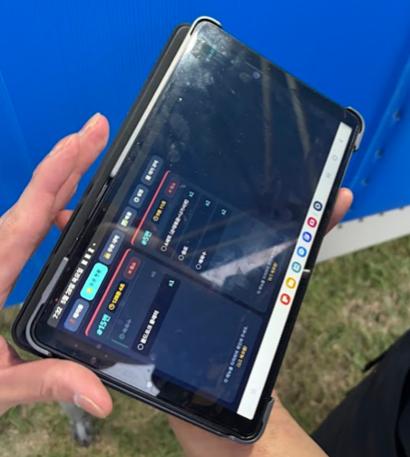
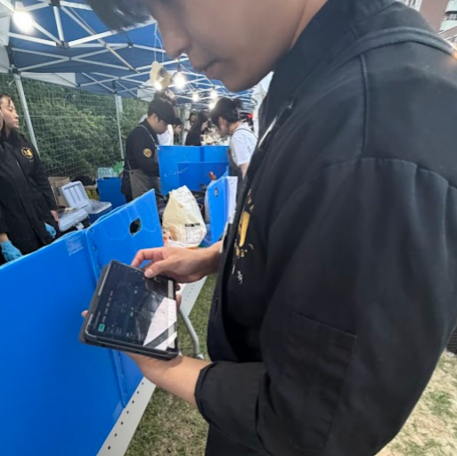

# 호남대학교 축제 주점 POS 및 모바일 오더 시스템 운영 평가서

본 문서는 2026년 5월 진행된 호남대학교 축제 주점의 무인/서빙 통합 POS 시스템의 실전 운영 결과와 이에 대한 기술적 및 운영적 평가를 정리한 보고서입니다.

---

## 1. 프로젝트 개요
- **프로젝트명**: 호남대학교 축제 주점 무인/서빙 통합 POS 시스템 (`Honam-Univ.-POS`)
- **운영 기간**: 2026년 5월 (대학 축제 기간)
- **개발 및 운영 역할**: 공동 개발자 / 백엔드 및 동시성 아키텍트 (최형민)
- **주요 기술 스택**: Python, Flask, Flask-SocketIO, SQLite3, JavaScript, PWA (Progressive Web App)

---

## 2. 현장 운영 모습 (실제 사진)

<table>
  <tr>
    <td align="center" width="50%">
      
       <b>[사진 1] 실전 운영 중인 오더 태블릿 인터페이스 (Socket.IO 연동 및 PWA 모드)</b>
    </td>
    <td align="center" width="50%">
      
       <b>[사진 2] 축제 현장 부스 내에서 스태프가 태블릿으로 실시간 주문 현황 확인 및 처리하는 모습</b>
    </td>
  </tr>
</table>

---

## 3. 핵심 운영 성과 및 기술 평가

### ① ngrok 외부 서버 구성을 통한 데이터 손실 없는 운영
- **문제 인식**: 현장 네트워크(축제 부스 내의 로컬 공유기 혹은 비공개 AP)는 유동 인구가 많아 전파 간섭이 심하고 물리적 충돌이나 전원 차단 등으로 수시로 끊길 위험이 있었습니다.
- **해결 방안 및 평가**: 서버를 로컬 PC가 아닌, 외부 안정적인 클라우드망 환경과 `ngrok` 터널링 서비스를 활용하여 외부 인터넷망 주소로 분리/배포했습니다.
- **결과**: 주점 운영 도중 현장 네트워크 단말이나 내부 AP 전원이 일시적으로 불안정해지거나 중간에 접속이 끊겼을 때도, 중앙 서버에 적재된 데이터에는 전혀 손실이 발생하지 않았으며 망 복구 즉시 데이터가 무중단으로 동기화되어 매끄러운 진행이 가능했습니다.

### ② 수기 주문 방식의 디지털 전환(DX)을 통한 주방 집중도 극대화
- **문제 인식**: 기존의 주점 운영 방식은 종이에 수기로 주문을 적어 직접 주방으로 뛰어가 전달하는 방식이었습니다. 이는 주문 누락, 서빙 혼선, 동선 낭비가 매우 극심했습니다.
- **해결 방안 및 평가**: 개발한 POS 및 모바일 오더링 시스템을 도입하여 고객 테이블에서 서빙 스태프가 스마트폰이나 태블릿으로 주문을 넣으면 주방 마스터 POS 화면에 실시간으로 주문이 적재되도록 하였습니다.
- **결과**: 기존에 전령 역할을 하던 스태프의 동선 낭비가 90% 이상 줄어들었습니다. 이로 인해 주점 스태프 대다수가 주문 배달 대신 **주방 요리 조리 및 서빙 준비 등 핵심 생산 업무에 집중**할 수 있게 되어 주방 회전율과 고객 만족도가 크게 향상되었습니다.

### ③ 고동시성 데이터베이스 설계 검증 (다수 디바이스 동시성 대응)
- **문제 인식**: 1대의 마스터 POS 단말기와 7대의 서빙용 모바일 오더기 등 총 8대의 디바이스가 쉴 새 없이 주문 및 테이블 상태 변경 정보를 송신하므로, 단일 파일 DB인 SQLite의 특성상 쓰기 락(`database is locked` 오류) 및 데이터 덮어쓰기(Lost Update)가 발생할 우려가 컸습니다.
- **해결 방안 및 평가**: 
  - SQLite3 DB의 **WAL(Write-Ahead Logging) 저널 모드를 활성화**하여 읽기/쓰기 작업이 서로를 블로킹하지 않도록 설계했습니다.
  - 트랜잭션 타임아웃을 30초로 넉넉하게 확장했습니다.
  - 주문 접수 및 착석 조작 등 중요한 CUD 쿼리 구간에 **IMMEDIATE 트랜잭션** 의무화를 적용하여 락 획득 시점의 선후 관계를 완벽히 통제했습니다.
- **결과**: 피크 타임 때 여러 디바이스에서 동시에 주문 신호를 연속해서 보냈음에도 불구하고, 단 한 번의 DB 잠금 오류나 데이터 누락 없이 모든 데이터가 순차적이고 무결하게 처리 완료되었습니다.

### ④ 실시간 서버 장애 대응 체계 구축 (WOL & TeamViewer)
- **문제 인식**: 외부 서버 장애 외에도, 현장 관리 서버 PC 자체가 갑자기 종료되거나 운영체제 먹통 등의 오류가 발생했을 때 즉각 복구할 수 없는 리스크가 존재했습니다.
- **해결 방안 및 평가**: 
  - 원격 부팅을 위해 내부 네트워크에 연결된 **KT 공유기 자체 웹 관리자 페이지의 WOL (Wake on LAN) 기능**을 활성화 및 구성했습니다.
  - PC 부팅 이후 원격 제어 및 서버 구동 여부 확인을 위해 **TeamViewer (팀뷰어)** 소프트웨어를 함께 상시 가동시켰습니다.
- **결과**: 만약 서버 컴퓨터가 꺼지거나 기술적 먹통이 되어도, 원격지에서 스마트폰이나 다른 기기로 KT 공유기 페이지에 접속해 즉시 컴퓨터를 원격 부팅(WOL)시킨 뒤 TeamViewer로 진입하여 서버 프로세스를 재가동시킬 수 있는 실시간 대응 시나리오를 완성했습니다. 이를 통해 어떤 물리적 전원/서버 다운 사태가 발생하더라도 5분 이내에 복원할 수 있는 신뢰성을 확보했습니다.

---

## 4. 종합 결론 및 의의
군 복무 시절 독자적으로 구축했던 '한식당 예약 프로그램'의 DB 설계 아이디어와 보안성 피드백을 기반으로 삼아, 실전 데이터 유실 방지와 동시성 처리를 선제적으로 고려한 아키텍처가 100% 성공을 거두었습니다. 

단순히 학술적인 코드 작성에 그치지 않고, 네트워크 불안정성과 동시성 제어라는 실제 환경의 물리적 제약 요건들을 소프트웨어 공학적으로 극복하여 **현업의 생산성 향상(주방 집중화 및 동선 최적화)과 무장애 데이터 일관성**을 입증해낸 실전 개발 및 운영 사례로 평가합니다.
